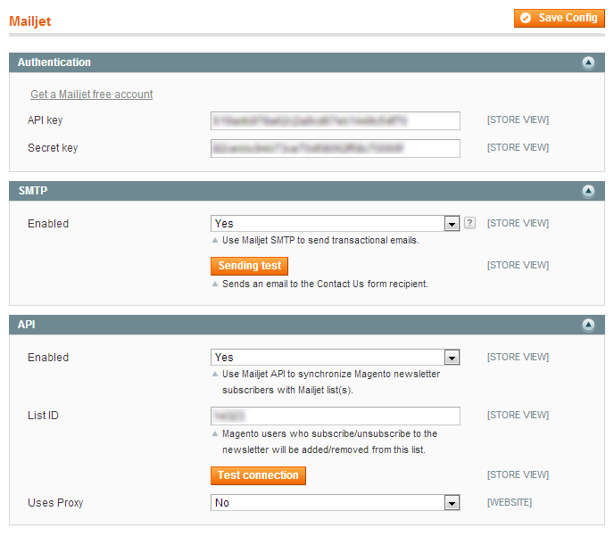

# Magento-Mailjet

> Magento 1 module that connects [Mailjet services](https://www.mailjet.com/docs) with your e-commerce website.

## Features
* Uses the Mailjet STMP instead of the local SMTP relay
* Uses the Mailjet API to synchronyze Magento newsletter subscribers with a Mailjet contacts list

## Screenshot

## Dependencies

* Mailjet account: https://www.mailjet.com
* Mailjet-API library: https://github.com/Narno/Mailjet-API/tree/zf1

## License

Released under the terms of the [Open Software License 3.0](http://opensource.org/licenses/OSL-3.0).

THE SOFTWARE IS PROVIDED "AS IS", WITHOUT WARRANTY OF ANY KIND, EXPRESS
OR IMPLIED, INCLUDING BUT NOT LIMITED TO THE WARRANTIES OF MERCHANTABILITY,
FITNESS FOR A PARTICULAR PURPOSE AND NONINFRINGEMENT. IN NO EVENT SHALL
THE AUTHORS OR COPYRIGHT HOLDERS BE LIABLE FOR ANY CLAIM, DAMAGES OR OTHER
LIABILITY, WHETHER IN AN ACTION OF CONTRACT, TORT OR OTHERWISE, ARISING
FROM, OUT OF OR IN CONNECTION WITH THE SOFTWARE OR THE USE OR OTHER
DEALINGS IN THE SOFTWARE.
